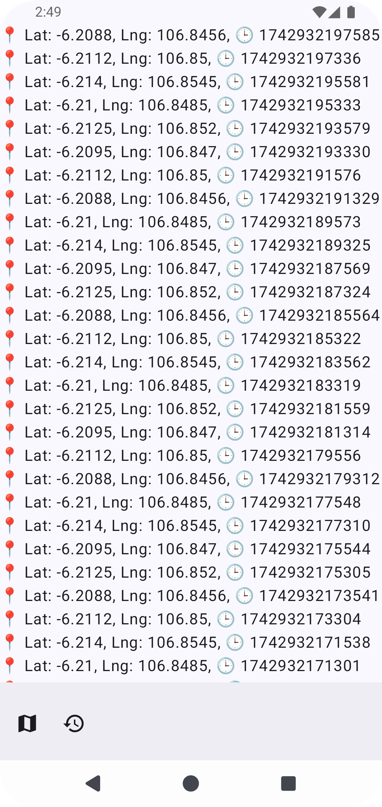

# 🚗 MiniFleetTracker
MiniFleetTracker is an Android application that displays real-time vehicle movement on Google Maps, monitors vehicle sensor data, and stores travel history using Room Database. Built with **Jetpack Compose**, **MVVM**, and **Koin Dependency Injection**.

---

## 📌 Key Features
✅ **Live Map Tracking** - Displays real-time vehicle movement on Google Maps.
✅ **Sensor Dashboard** - Monitors vehicle speed, engine status, and door status.
✅ **Event Alerts** - Shows warnings if the speed exceeds the limit or if the door is open while moving.
✅ **Trip History** - Stores and displays a list of locations the vehicle has traveled through.
✅ **Material Design 3** - Modern UI with animations and responsive themes.

---

## 🛠 Technologies Used
- **Kotlin** + Jetpack Compose
- **Google Maps SDK** for vehicle tracking
- **Room Database** for storing trip history
- **Koin** for Dependency Injection
- **Material 3** for modern UI/UX

---

## 🚀 How to Run the Application
1️⃣ Clone this repository:
```sh
git clone https://github.com/username/MiniFleetTracker.git
cd MiniFleetTracker
```
2️⃣ Open in Android Studio.
3️⃣ Run the application on an emulator or physical device.
4️⃣ Ensure the Google Maps API Key is configured in `local.properties`:
```properties
MAPS_API_KEY=your_google_maps_api_key
```

---

## 📸 Screenshots / Demo Video




---

## 📜 License
MIT License © 2024 Kristian Ekachandra
